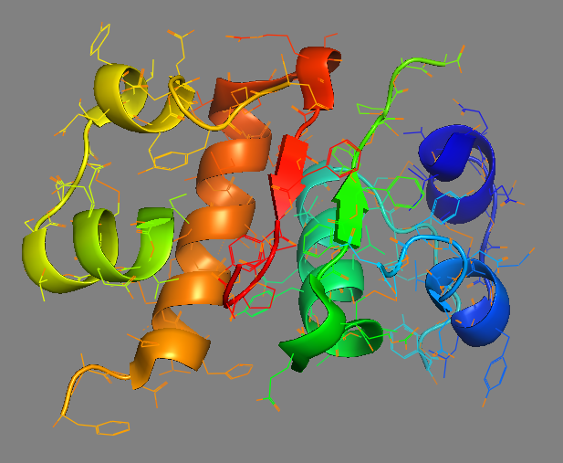
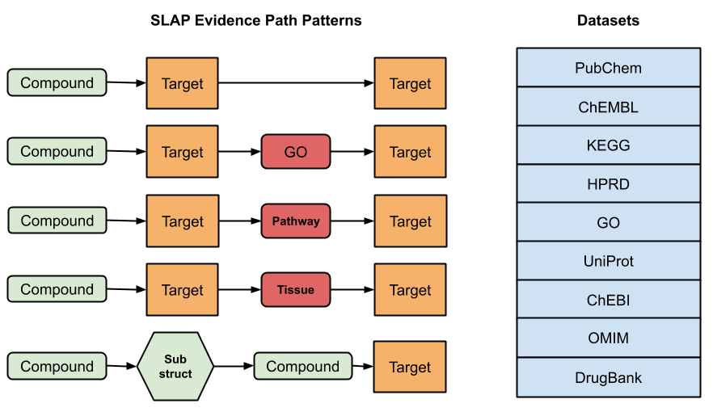
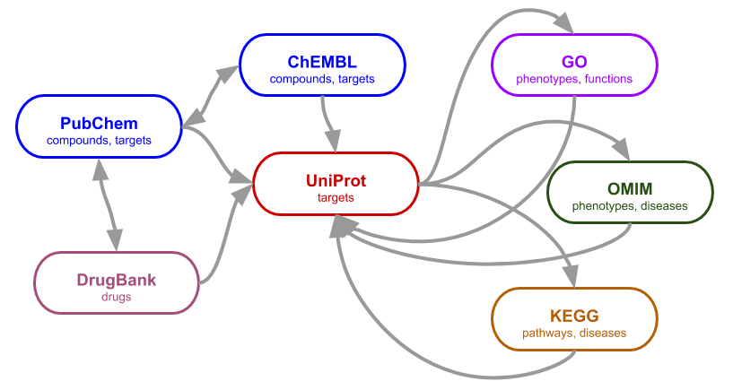

# T2D-Net 

IU Integrative Data Science Lab (IDSL) Type-2 Diabetes project

The output dataset produced by the IU Integrative Data Science Lab T2D project.  In this
CTSI-funded project, "Semantically mapping the hidden molecular connections of type-2
diabetes", Chem2Bio2RDF and SLAP were applied for knowledge discovery.  We share the
resulting dataset as a knowledge network (KN), for further use by the research community.

## Counts

| type | count | notes |
|---|---|---|
| query compounds | 16 | T2D drugs, with PubChem CIDs |
| query targets | 2228 | C2B2R protein targets with SwissProt IDs |
| compounds | 289 | PubChem CIDs |
| associated targets | 71 | Associated by SLAP DT queries |
| GO | 39 | Gene Ontology class |
| chebi | 18 |  |
| pathway | 12 | KEGG pathway |
| disease | 2 | OMIM disease |
| side effect | 3 | SIDER entity |
| substructure | 7 | chemical substructure |
| tissue | 1 | ~ |

## Files
| file | contents |
|---|---|
| `diabetes_drugs.smi` | 16 SMILES, PubChem CIDs, and names |
| `protein_list.csv` | 2228 C2B2R protein targets with SwissProt IDs
| `t2d_dtp_links.csv` | SLAP summary results, 56 associations |
| `t2d_dtp.csv` | SLAP results, includes 56 hits and 35592 misses |
| `slap_dtp_merged.xgmml` | Merged, annotated, association network |
| `CID_TID.graphml` | (56 files) association networks for all SLAP hits |

## Glossary
| term | definition |
|---|---|
| T2D or T2DM | Type-2 Diabetes, a.k.a. Type-2 Diabetes Mellitus |
| C2B2R | Chem2Bio2RDF |
| SLAP| Semantically Linked Association Prediction |
| DTP | drug-target prediction (SLAP method) |
| KN or KG | knowledge network or graph |
| AN | association network, refers to SLAP sub-network associating one compound to one target, including linking associations |



From query compounds which are known diabetes drugs,heterogeneous linked datasets lead to novel targets via domain appropriate path patterns.




### Methodology notes

```
slap_dtp_merged_nodes_export.csv "class" counts:
"class" is column 5.
values, col 5 "class", unique: 10 ; total: 443
                   class        counts
                    "GO"            39 ( 8.804%)
                 "chebi"            18 ( 4.063%)
                  "gene"            71 (16.027%)
           "gene_family"             1 ( 0.226%)
          "kegg_pathway"            12 ( 2.709%)
          "omim_disease"             2 ( 0.451%)
      "pubchem_compound"           289 (65.237%)
                 "sider"             3 ( 0.677%)
          "substructure"             7 ( 1.580%)
                "tissue"             1 ( 0.226%)

slap_dtp_merged_edges_export.csv "label" counts:
"label" is column 5.
values, col 5 "label", unique: 11 ; total: 4577
                   label        counts
                 "GO_ID"           290 ( 6.336%)
      "Gene_Family_Name"            32 ( 0.699%)
                 "chebi"           163 ( 3.561%)
         "chemogenomics"          3630 (79.310%)
                   "cid"            52 ( 1.136%)
                  "drug"            31 ( 0.677%)
            "expression"           146 ( 3.190%)
                  "hprd"           110 ( 2.403%)
               "protein"            73 ( 1.595%)
          "substructure"            48 ( 1.049%)
                "tissue"             2 ( 0.044%)
```

## Neo4j Import

[Neo4j](http://neo4j.com)
has emerged as a leading graph database system,
combining concepts from Semantic Web Technologies,
including RDF `Subject`&rarr;`Predicate`&rarr;`Object` triples, with
the reliability and performance of enterprise software.
Although a commercial product, [Neo4j](http://neo4j.com)
provides a free Community Edition, and supports open standards
such as Sparql queries and JSON results.
We have followed the example of other biomedical informatics
projects by converting the T2D-Net dataset
to Neo4j and sharing the workflow.


```
neo4j-client -i load_cytoscape_cyjs2tsv.cql -u neo4j -p ****** localhost
neo4j-client -i load_extras.cql -u neo4j -p ****** localhost
neo4j-client -i db_describe.cql -u neo4j -p ****** localhost
```

## Dependencies

* [GitHub:Chem2Bio2RDF](https://github.com/IUIDSL/Chem2Bio2RDF)
* [GitHub:slap-api](https://github.com/IUIDSL/slap-api)
* [GitHub:BioClients](https://github.com/jeremyjyang/BioClients)
